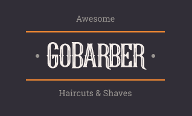

<h1 align="center">
  <br /><br />
</h1>

<h3 align="center">
  GoBarber - The easiest way to book hairdressing appointment for hair stylist and clients
</h3>

<p align="center">
  

  <a href="https://www.linkedin.com/in/luishng/">
    
  </a>
  
  
  
  <a href="https://github.com/luishng/gobarber/commits/master">
    
  </a>
  
  <a href="https://github.com/luishng/gobarber/issues">
    
  </a>
  
  
</p>

# 📍 Table of Contents

<p align="center">
  <a href="#recycle-about-the-project">About the project</a>&nbsp;&nbsp;&nbsp;|&nbsp;&nbsp;&nbsp;
  <a href="#-technologies">Technologies</a>&nbsp;&nbsp;&nbsp;|&nbsp;&nbsp;&nbsp;
  <a href="#-getting-started">Getting Started</a>&nbsp;&nbsp;&nbsp;|&nbsp;&nbsp;&nbsp;
  <a href="#-features">Features</a>&nbsp;&nbsp;&nbsp;|&nbsp;&nbsp;&nbsp;
  <a href="#-license">License</a>
</p>

## 💈 About the project

This software provides a registration system hairdressers and appointments, where hairdressers can register, register their opening hours and customers can view these times and register an appointment with him. The web system is used by the hairdresser and the mobile by the customers.

## 🚀 Technologies

**Language:**
- [TypeScript](https://www.typescriptlang.org/)

**Backend(Server):**
- [Node.js](https://nodejs.org/en/)
- [Express](https://expressjs.com/pt-br/)
- [Handlebars](https://handlebarsjs.com/)
- [Tsyringe](https://github.com/microsoft/tsyringe)
- [TypeORM](https://typeorm.io/)
- [PostgreSQL](https://www.postgresql.org/)
- [MongoDB](https://www.mongodb.com/)
- [Redis](https://redis.io/)
- ...

**Web:**
- [ReactJS](https://reactjs.org/)
- [React Router DOM](https://reacttraining.com/react-router/)
- [React Icons](https://react-icons.netlify.com/)
- [React-Day-Picker](https://react-day-picker.js.org/)
- [Styled-Components](https://styled-components.com/)
- [Polished](https://polished.js.org/)

**Mobile:**
- [React Native](https://reactnative.dev/)
- [React Navigation](https://reactnavigation.org/)
- [Polished](https://polished.js.org/)
- [Styled-Components](https://styled-components.com/)

## 🔗 Features

- Register in the system by email and password
- Authenticate in the system
- Recover password by email
- Edit profile
- Search for hair stylist
- Register new appointments
- View next client

## 🏁 Getting Started

**Install the requirements**

- [Git](https://git-scm.com/)
- [Node.js](https://nodejs.org/en/)
- [Yarn](https://classic.yarnpkg.com/) or [npm](https://www.npmjs.com/)
- [Android studio](https://developer.android.com/studio) or [Xcode](https://developer.apple.com/xcode/)
- [Docker](https://www.docker.com/) 

**Clone the project and access the folder**

```bash
$ git clone https://github.com/luishng/gobarber.git && cd gobarber
```
<!-- 
**Follow the steps below for installation**

### Server

```bash
# Starting from the project root folder, go to server folder
$ cd server

# Install the dependencies
$ yarn

# Use the script to run the migrations
$ yarn knex:migrate

# Use the script to run the seeds
$ yarn knex:seed

# To finish, run the api service
$ yarn dev

# Well done, project is started!
```

### Web

_PS: Before to continue, be sure to have the API running (Backend - Server)_

```bash
# Starting from the project root folder, go to frontend web folder
$ cd web

# Install the dependencies
$ yarn

# Be sure the file 'src/services/api.ts' have the IP to your API

# Start the client
$ yarn start
```

### Mobile

_PS: Before to continue, be sure to have the API running (Backend - Server)_

```bash
# Starting from the project root folder, go to mobile folder
$ cd mobile

# Install the dependencies
$ yarn

# Be sure the file 'src/services/api.ts' have the IP to your API

# Start the expo service and scan the QR code with Expo Client
$ yarn start
``` -->

## 📝 License

This project is licensed under the MIT License - see the [LICENSE](LICENSE) file for details.

---

Made with 💙&nbsp; by [Luis Henrique](https://github.com/luishng) 👋 &nbsp;[See my linkedin](https://www.linkedin.com/in/luishng/) 👷